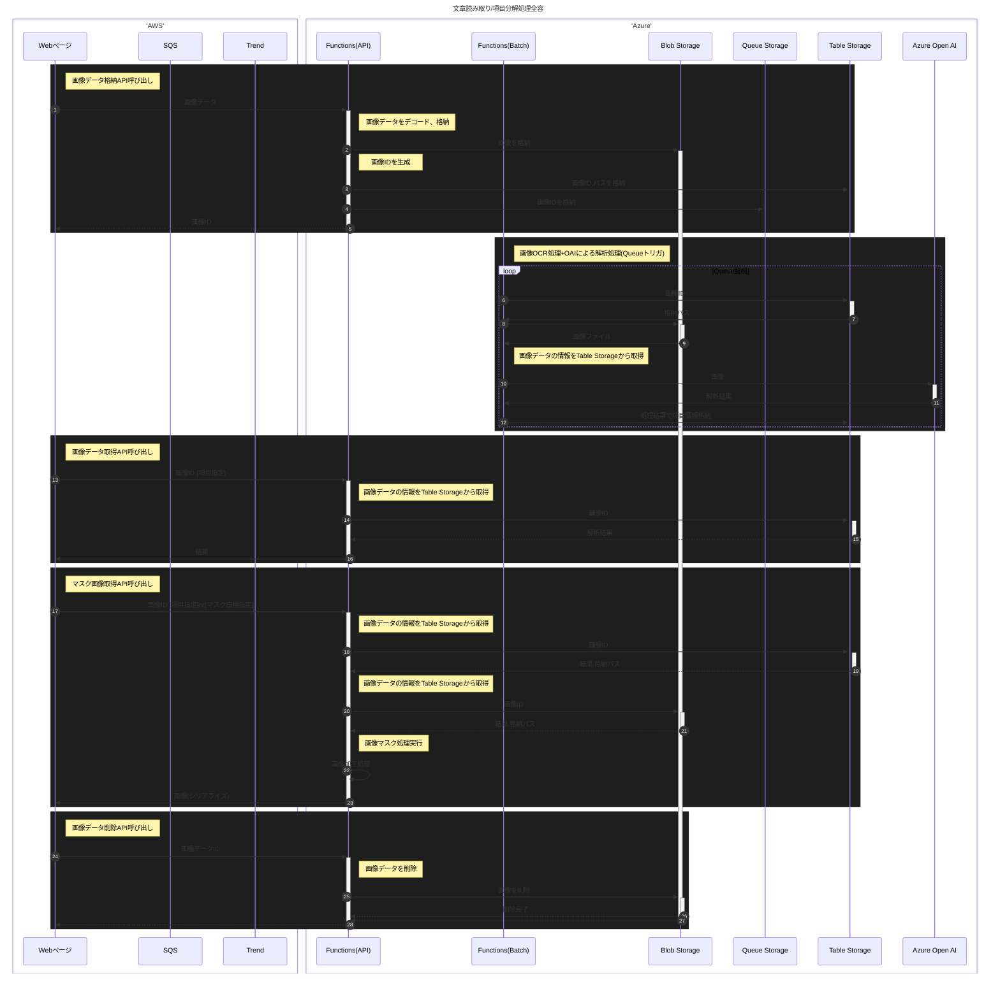

```mermaid
sequenceDiagram
    title 文章読み取り/項目分解処理全容
    autonumber
    box 'AWS'
        participant Client as Webページ
        participant SQS as SQS
        participant Trend as Trend
    end
    box 'Azure'
        participant API as Functions(API)
        participant Batch as Functions(Batch)
        participant Storage as Blob Storage
        participant Queue as Queue Storage
        participant Table as Table Storage
        participant oai as Azure Open AI
    end 

    rect rgb(30,30,30)
        Note right of Client: 画像データ格納API呼び出し
        Client->>+API: 画像データ
        Note right of API: 画像データをデコード、格納
        API->>+Storage: 画像を格納
        Note right of API: 画像IDを生成
        API->>+Table: 画像ID,パスを格納
        API->>+Queue: 画像IDを格納
        API-->>-Client: 画像ID
    end 
    
    rect rgb(30,30,30)
        Note right of Batch: 画像OCR処理+OAIによる解析処理(Queueトリガ)
        loop Queue監視
            Batch->>+Table: 画像ID
            Table->>-Batch: 格納パス
            Batch->>+Storage: 
            Storage->>-Batch: 画像ファイル

            Note right of Batch: 画像データの情報をTable Storageから取得
            Batch->>+oai: 画像
            oai->>-Batch: 解析結果
            
            Batch->>+Table: 処理結果で項目情報格納
        end
    end

    rect rgb(30,30,30)
        Note right of Client: 画像データ取得API呼び出し
        Client->>+API: 画像ID,[項目指定]

        Note right of API: 画像データの情報をTable Storageから取得
        API->>+Table: 画像ID
        Table-->>-API: 解析結果
        
        API->>-Client: 結果 
    end


    rect rgb(30,30,30)
        Note right of Client: マスク画像取得API呼び出し
        Client->>+API: 画像ID,[項目指定]or[マスク座標指定]

        Note right of API: 画像データの情報をTable Storageから取得
        API->>+Table: 画像ID
        Table-->>-API: 結果,格納パス

        Note right of API: 画像データの情報をTable Storageから取得
        API->>+Storage: 画像ID
        Storage-->>-API: 結果,格納パス

        Note right of API: 画像マスク処理実行
        API->>API: 画像加工処理

        API->>-Client: 画像(シリアライズ)
    end

    rect rgb(30,30,30)
        Note right of Client: 画像データ削除API呼び出し
        Client->>+API: 画像データID
        Note right of API: 画像データを削除

        API->>+Storage: 画像を削除
        Storage-->>-API: 削除完了
        Storage-->>-API:　
        API-->>-Client: 
    end
```
